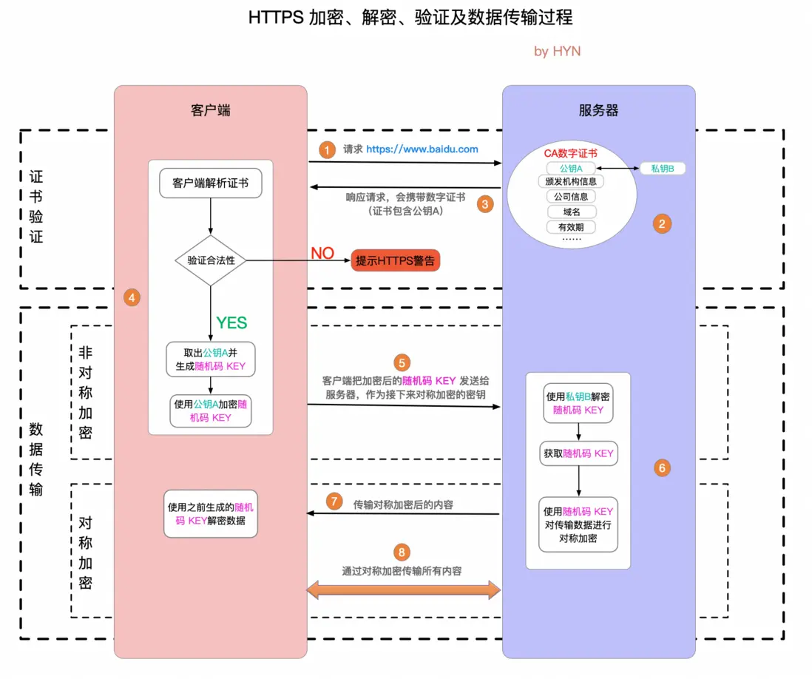

# http

## 定义

HTTP 超文本传输协议是位于 TCP/IP 体系结构中的应用层协议，其内部 API XMLHttpRequest，它是 web 数据通信的基础。现代浏览器中 Fetch API 中也提供了相同功能。

## 特征

1. 支持客户/服务器模式。
2. 简单快速：客户向服务器请求服务时，只需传送请求方法和路径。请求方法常用的有 GET、HEAD、POST。每种方法规定了客户与服务器联系的类型不同。由于 HTTP 协议简单，使得 HTTP 服务器的程序规模小，因而通信速度很快。
3. 灵活：HTTP 允许传输任意类型的数据对象。正在传输的类型由 Content-Type 加以标记。
4. 无连接：无连接的含义是限制每次连接只处理一个请求。服务器处理完客户的请求，并收到客户的应答后，即断开连接。采用这种方式可以节省传输时间。早期这么做的原因是请求资源少，追求快。后来通过 Connection: Keep-Alive 实现长连接
5. 无状态：HTTP 协议是无状态协议。无状态是指协议对于事务处理没有记忆能力。缺少状态意味着如果后续处理需要前面的信息，则它必须重传，这样可能导致每次连接传送的数据量增大。另一方面，在服务器不需要先前信息时它的应答就较快。

## 优势

1. 灵活性强，可拓展性高

- 允许传输各种类型数据，通过 content-type 来却分
- 从 1.0，1.1，2.0 一直在拓展

2. 传输可靠

- 通过 TCP 协议，建立连接和断开

## 注意点

1. 通讯不加密，容易被窃听到
   解决办法：https
2. 不验证身份
   解决办法：https，请求头验证

# https

## 定义

相当于 HTTP+SSL/TLS， 即 HTTP 下加入 SSL 层，HTTPS 的安全基础是 SSL，因此加密的详细内容就需要 SSL，用于安全的 HTTP 数据传输。

SSL（Secure Socket Layer，安全套接字层）：1994 年为 Netscape 所研发，SSL 协议位于 TCP/IP 协议与各种应用层协议之间，为数据通讯提供安全支持。

TLS（Transport Layer Security，传输层安全）：其前身是 SSL，它最初的几个版本（SSL 1.0、SSL 2.0、SSL 3.0）由网景公司开发，1999 年从 3.1 开始被 IETF 标准化并改名，发展至今已经有 TLS 1.0、TLS 1.1、TLS 1.2 三个版本。SSL3.0 和 TLS1.0 由于存在安全漏洞，已经很少被使用到。TLS 1.3 改动会比较大，目前还在草案阶段，目前使用最广泛的是 TLS 1.1、TLS 1.2。

分为三块，1. 证书验证；2. 公钥加密 key 传输初始信息，私钥解密（非对称）；3. 私钥加密解密传输数据（对称）。

## 怎么使用

## 好处

1. 通过加密算法，避免 http 数据传输被窃听

## 注意点

1. 由于需要对证书判定、数据加密解密，请求时间会更慢，资源消耗也会更大
2. 需要去机构申请 CA 证书，颁发证书和公钥私钥
3. 并不是百分百安全的，黑客攻击和服务器被劫持一样没用

# https2.0

## 定义

2015 年发布的 http 第二个主要版本。在不改动 HTTP 语义、方法、状态码、URI 及首部字段的情况下，大幅度提高了 web 性能。

1. 二进制分帧层

- 将 1.1 的文版传输方式，切分成了两个分帧，header 和 data 两个帧层
- 并用二进制进行编码，更加健壮

2. 多路复用

- 1.1 会有线头阻塞和多个 TCP 连接的问题，2.0 引入了帧和流两个概念，流是由多个帧组成的。一个 TCP 连接里可以包含多个流，既可以发送多个请求，对端可以知道每个帧属于哪个各流。这些帧是乱序发送的，并且流控制会帮我们根据资源情况，停止、减少帧的发送，最后到对端根据流标识重新组成完整的信息。

3. 头部压缩

- 1.1 每次都会重复发一些信息，比如请求头里的，2.0 做了头部压缩处理和索引表的简历，重复的信息使用索引传输，到对端在索引表里取值

4. 服务器主动推送

5. 更安全

- 使用 TLS 做了拓展

## 怎么使用

## 好处

1. 性能提升：HTTP/2.0 采用了二进制传输数据，而非之前的文本格式，这大大提高了传输效率。同时，它还引入了流控制和帧压缩等机制，进一步提升了数据传输的性能。
2. 更好的并发性：HTTP/2.0 支持并发请求，这意味着服务器可以同时处理多个请求，从而提高了应用的响应速度和效率。
3. 安全性增强：HTTP/2.0 采用了 TLS 1.2 或更高版本的加密协议，提供了更强的安全性保护，有效防止了中间人攻击。
4. 头部压缩：HTTP/2.0 使用 HPACK 算法对头部进行压缩，显著减少了传输的数据量，提高了传输效率。
5. 多路复用：HTTP/2.0 通过单个连接实现多个请求的并行处理，减少了连接建立和释放的开销，提高了整体性能。
6. 服务器推送：HTTP/2.0 允许服务器将响应主动推动到客户端缓存中，避免了后续请求这些资源时的往返时间浪费。

## 注意点

1. 复杂性增加：HTTP/2.0 相对于 HTTP/1.1 在协议设计和实现上更为复杂，这可能导致一些开发人员和服务器管理员在理解和使用上存在一定的困难。
2. 依赖 TLS：HTTP/2.0 强制要求使用 TLS 进行加密传输，这可能增加了部署和配置的成本和复杂性。同时，如果服务器或客户端不支持 TLS，那么它们将无法使用 HTTP/2.0。
3. 潜在的兼容性问题：由于 HTTP/2.0 的复杂性和新的特性，它可能与某些旧的浏览器、代理服务器或网络设备存在兼容性问题。这可能导致一些用户无法正常使用基于 HTTP/2.0 的服务。
4. 更高的带宽需求：虽然 HTTP/2.0 通过头部压缩和多路复用等技术提高了传输效率，但它也可能导致更高的带宽需求。因为在一个连接上并发处理多个请求时，可能会同时传输更多的数据。
