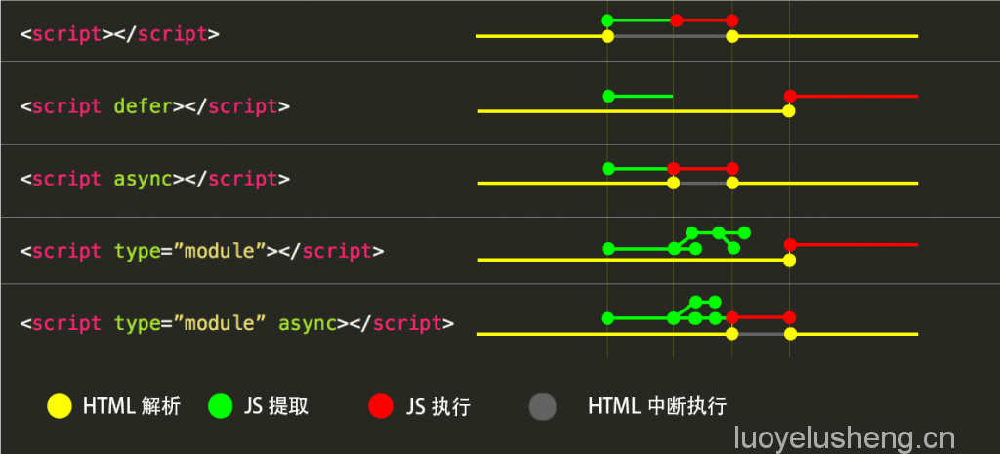

# 浏览器资源加载
## 预加载新标准api
1. link-prefetch
    * 作为link的rel属性的值，允许浏览器后台在空闲时间获取将来可能用到的资源，并且储存在缓存中，当请求prefetched的资源时，直接读取缓存中的。
    * 低优先级
    * 不要滥用，因为不知道用户的下一步动作，很可能浪费资源。
2. dns-prefetch
    * 允许浏览器后台在后台运行DNS解析，下次请求该地址时直接在本地dns解析表里找，减少了dns服务查ip的时间
    ```html
      <link rel="dns-prefetch" href="//cdn.domain.com">
    ```
3. prerender
    * 允许浏览器后台渲染整个页面，当跳转时，直接呈现，减少页面加载时间
    ```html
      <link rel="prerender" href="http://www.maps131.cn">
    ```
4. preconnect
    * 允许浏览器在一个 HTTP 请求正式发给服务器前预先执行一些操作，这包括 DNS 解析，TLS 协商，TCP 握手，先建立连接，而不下载任何内容，这消除了往返延迟并为用户节省了时间
    ```html
      <link href="https://cdn.domain.com" rel="preconnect" crossorigin>
    ```
5. preload
    * 指明哪些资源是在页面加载完成后即刻需要的，在浏览器的主渲染机制介入前就进行预加载
    ```html
      <head>
        <meta charset="utf-8">
        <title>JS and CSS preload example</title>

        <link rel="preload" href="style.css" as="style">
        <link rel="preload" href="main.js" as="script">

        <link rel="stylesheet" href="style.css">
      </head>

      <body>
        <h1>bouncing balls</h1>
        <canvas></canvas>
        <script src="main.js"></script>
      </body>
    ```
  * 可加载类型audio、document内嵌html页）、fetch（arraybuffer\json）、font、image、object、script、style、video、track、worker(web worker或shared worker)
  * MIME类型，浏览器将使用type属性来判断它是否支持这一资源，如果浏览器支持这一类型资源的预加载，下载将会开始，否则便对其加以忽略
  ```html
    <head>
      <meta charset="utf-8">
      <title>Video preload example</title>
      <link rel="preload" href="sintel-short.mp4" as="video" type="video/mp4">
    </head>
    <body>
      <video controls>
        <source src="sintel-short.mp4" type="video/mp4">
        <source src="sintel-short.webm" type="video/webm">
        <p>Your browser doesn't support HTML5 video. Here is a <a href="sintel-short.mp4">link to the video</a> instead.</p>
      </video>
    </body>
  ```
  * 跨域获取
    ```html
      <link rel="preload" href="fonts/cicle_fina-webfont.eot" as="font" type="application/vnd.ms-fontobject" crossorigin="anonymous">
    ```
  * 结合媒体media属性，作响应式加载
    ```html
      <link rel="preload" href="bg-image-narrow.png" as="image" media="(max-width: 600px)">
      <link rel="preload" href="bg-image-wide.png" as="image" media="(min-width: 601px)">

      <link rel="stylesheet" href="main.css">

      <script>
        var mediaQueryList = window.matchMedia("(max-width: 600px)");
        var header = document.querySelector('body');
        if(mediaQueryList.matches) {
          header.style.backgroundImage = 'url(bg-image-narrow.png)';
        } else {
          header.style.backgroundImage = 'url(bg-image-wide.png)';
        }
      </script>
    ```
  * js demo
    ```js
      /* 预加载，不执行 */
      var preloadLink = document.createElement("link");
      preloadLink.href = "myscript.js";
      preloadLink.rel = "preload";
      preloadLink.as = "script";
      document.head.appendChild(preloadLink);
      /* 插入dom执行 */
      var preloadedScript = document.createElement("script");
      preloadedScript.src = "myscript.js";
      document.body.appendChild(preloadedScript);
    ```
## 异步加载


* 默认情况HTML解析，然后加载JS，此时HTML解析中断，然后执行JS，最后JS执行完成恢复HTML解析。
* defer情况下HTML和JS并驾齐驱，最后才执行JS
* async情况则HTML和JS并驾齐驱，JS的执行可能在HTML解析之前就已经完成了
* 最后module情况和defer的情况类似，只不过会在提取的过程中加载多个JS文件罢了

1. defer
    * 不阻碍html解析，与解析并行，在解析完成后执行，最迟也会在DOMContentLoaded事件前执行完
    * 要等到整个页面在内存中正常渲染结束（DOM 结构完全生成，以及其他脚本执行完成），才会执行
    * 渲染完再执行
2. async
    * 不阻碍html解析，与解析并行，加载完立即执行，执行阻断解析，所以不能保证html全部解析完成
    * 一旦下载完，渲染引擎就会中断渲染，执行这个脚本以后，再继续渲染
    * 下载完就执行
> 如果你的脚本依赖于DOM构建完成是否完成，则可以使用defer；如果无需DOM的构建，那就可以放心的使用async了
3. module
    * script中添加此类型，可在其内使用而生模块导入导出语法
    ```html
      <script type="module">
        import { Max } from "./math.js";
        console.log(Max(1, 2, 7, 2, 0)); //7
      </script>
    ```
    * 注意事项
        1. module默认使用了”use strict”模式，这也意味着不能使用诸如arguments.callee这一类的语法。
        2. 模块只会加载一次，无论前后你写了多少次。
        3. 不支持<!–const a = 1–>注释。
        4. module有自己的词法作用域，比如定义一个 var a = 1，并不会创建一个全局变量，因此你并不能通过window.a 访问到它的值。

## 页面加载过程
1. 拿到地址，进入应用层，DNS解析，发起http请求（细节待补充）
2. 进入传输层使用tcp协议，然后通过网路层、数据链路层、物理层，建立三次握手连接
3. 传输html页面数据，
4. 开始解析html的文档，开启下载线程，对所有资源进行优先级排序下载
5. 解析到在头部
6. 遇到script，阻断解析，加载完成后，直接执行
7. 遇到link，不阻断解析，加载完成，则构建css rule tree
8. 解析到body
9. 遇到script，阻断解析，将之前解析的domtree和csstree生成rendertree渲染到页面
10. 遇到link，将之前解析的domtree和csstree渲染到页面，但阻碍后面的dom渲染
11. 文档解析完毕，页面重新渲染。页面内引用的所有同步代码执行完毕，触发DOMContentLoaded事件
12. html文档中的图片资源，js代码中的异步加载资源全部完成（video，audio，flash不影响），触发load事件
> window.performance可查看个阶段时间